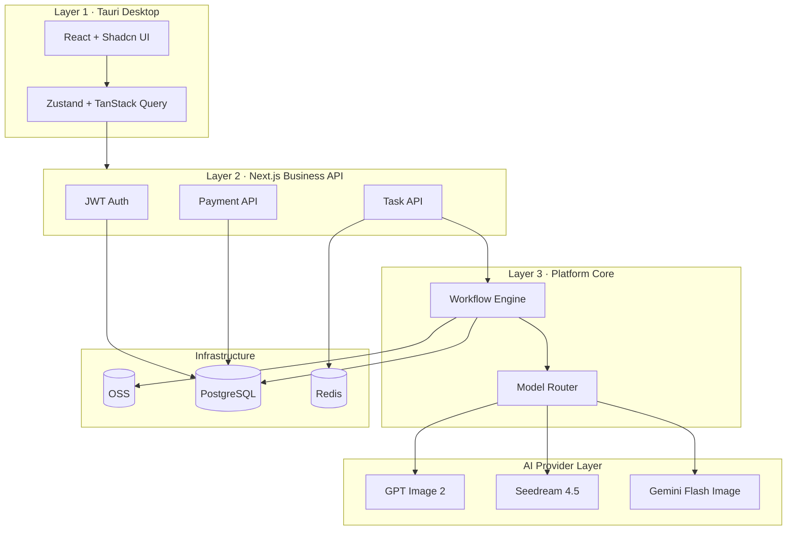

# AI Commerce Studio · System Architecture

## 1. 架构总览



## 2. 包依赖关系

```
apps/desktop ──HTTP──► apps/api
apps/api ─────────────► packages/workflow-engine
apps/api ─────────────► packages/model-router
apps/api ─────────────► packages/ai-providers
packages/workflow-engine ──► packages/core
packages/model-router ─────► packages/core
packages/ai-providers ─────► packages/core
```

## 3. 任务生命周期

```
Client POST /api/task/create
    → 鉴权 + 积分预检
    → WorkflowEngine.run(workflowId, payload)
    → 各 Node 顺序/并行执行
    → ModelRouter.select() 在 generate 节点
    → AIProvider.generate()
    → OSS 持久化
    → 扣积分 + point_logs
    → 更新 tasks.status
Client GET /api/task/status?id=
```

## 4. Workflow 配置

工作流定义位于 `packages/workflow-engine/workflows/*.json`，运行时由 `WorkflowEngine` 解析，**禁止在 API 层写 task 类型分支**。

## 5. Model Router 配置

路由规则位于 `packages/model-router/rules.ts`，支持：

- 按 `taskType` / `category` / `complexity` / `userLevel` 选 provider
- `fallbackChain` 故障转移（如 gpt-image → seedream）

## 6. 数据库（Prisma）

见 `prisma/schema.prisma` — 与 PRD 字段对齐，扩展 `TaskStatus` · `PointChangeType` 等枚举。

## 7. Redis Key 约定

| Key | 用途 | TTL |
|-----|------|-----|
| `acs:token:{userId}` | JWT 黑名单/会话 | 7d |
| `acs:user:{id}` | 用户信息缓存 | 5m |
| `acs:points:{userId}` | 积分余额缓存 | 1m |
| `acs:task:{taskId}` | 任务状态 | 24h |

**队列：**

- `acs:queue:ai` — 单任务
- `acs:queue:batch` — 批量任务

## 8. OSS 路径

```
/uploads/{userId}/{date}/{uuid}.jpg    # 原图
/results/{taskId}/{index}.png          # 结果
/thumbnails/{taskId}/thumb.jpg         # 缩略图
/temp/{uuid}                           # 临时
```

## 9. 安全边界

| 规则 | 说明 |
|------|------|
| Desktop 无 Provider API Key | Key 仅存服务端 |
| 所有 AI 调用经 Workflow | 统一计费与审计 |
| 积分先检后扣 | 失败回滚不写 point_logs CONSUME |

## 10. 部署拓扑（SaaS）

```
Tauri Client ──HTTPS──► Nginx ──► Next.js (apps/api)
                              ├──► PostgreSQL
                              ├──► Redis
                              └──► OSS (S3 兼容)
```

Desktop 与 Web Admin 共用同一 Business API。
